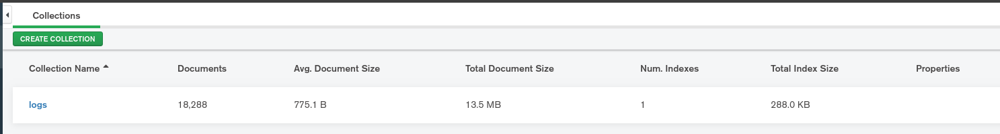

<!--
 Copyright 2020 Kaan Karakaya

 Licensed under the Apache License, Version 2.0 (the "License");
 you may not use this file except in compliance with the License.
 You may obtain a copy of the License at

     http://www.apache.org/licenses/LICENSE-2.0

 Unless required by applicable law or agreed to in writing, software
 distributed under the License is distributed on an "AS IS" BASIS,
 WITHOUT WARRANTIES OR CONDITIONS OF ANY KIND, either express or implied.
 See the License for the specific language governing permissions and
 limitations under the License.
-->
[](https://twitter.com/YkkCode "Twitter: YkkCode")
[](https://microbadger.com/images/theykk/logger )
[](https://microbadger.com/images/theykk/logger )
[](https://hub.docker.com/r/theykk/logger)

# TheYkk K8S Logger

This tool runs a pod at every node in K8s via deamonset.
The pod connects node's /var/log/containers folder and adds to mongodb by collecting logs


Supports 25 Parsers


Average log size ~ 700 byte



## Installation

Create mongodb url secret

```sh
kubectl create secret generic theykk-logger --from-literal=MONGO_URI=<Mongodb connection url>
```

Apply rbac and deamonset

```sh
kubectl apply -f https://raw.githubusercontent.com/TheYkk/logger/master/rbac.yaml

kubectl apply -f https://raw.githubusercontent.com/TheYkk/logger/master/deamonset.yaml
```

## Buil docker image

```sh
DOCKER_BUILDKIT=1 docker build -t theykk/logger .
```

and push the docker hub

```sh
docker push theykk/logger
```

## Author

👤 **TheYkk &lt;Kaan Karakaya yusufkaan142@gmail.com&gt;**

* Twitter: [@YkkCode](https://twitter.com/YkkCode)
* Github: [@TheYkk](https://github.com/TheYkk)

## Show your support

Give a ⭐️ if this project helped you!

## License

[APACHE](https://choosealicense.com/licenses/apache-2.0/)
